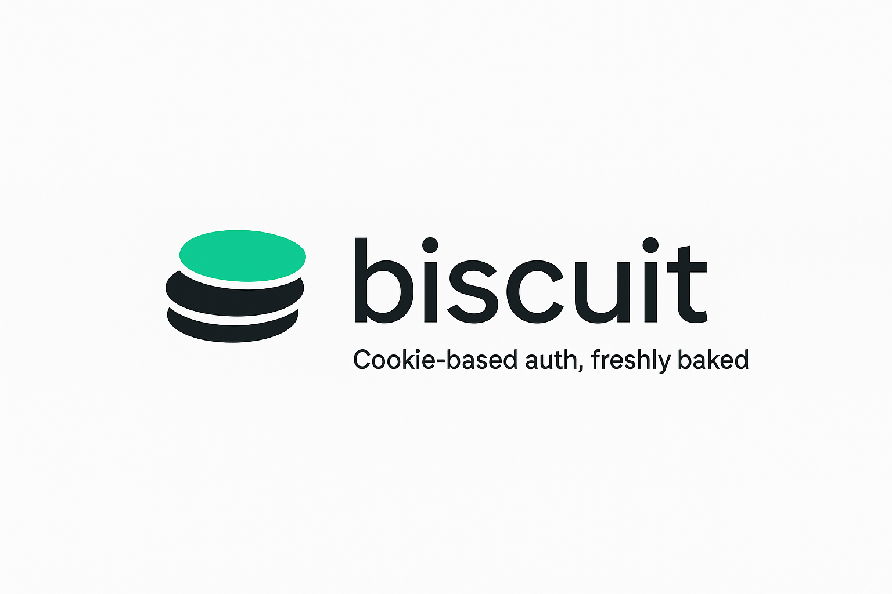

<p align="center">
  
</p>

[][nuxt-href]
[][license-href]

Lightweight Nuxt module for Nuxt 3/4 that wires a Nuxt frontend to a Laravel Sanctum backend using first-party cookie authentication. Nuxt Biscuit ships a preconfigured composable, route middleware, and runtime plugin so you can log users in, out, and guard pages with only a few lines of code.

## Features

- ✅ Fetches and caches the authenticated user automatically on app mount
- 🍪 Handles Sanctum CSRF cookie flow (including decoding `XSRF-TOKEN`)
- 🔐 Provides `auth` and `guest` route middleware for protected/guest pages
- ⚙️ Exposes a fully typed `useBiscuit` composable with `login`, `logout`, `fetchUser`, and `onUserChange`
- 🔁 Emits client-side hooks whenever the user session changes

## Requirements

- Nuxt `^3.0.0 || ^4.0.0`
- Laravel backend configured with Sanctum and cookie-based authentication

## Installation

Add the dependency to your project:

```bash
npm install nuxt-biscuit
```

Register the module inside your `nuxt.config`:

```ts
export default defineNuxtConfig({
  modules: ['nuxt-biscuit'],
  biscuit: {
    baseUrl: process.env.API_BASE_URL ?? 'http://localhost:8000',
    endpoints: {
      csrf: '/sanctum/csrf-cookie',
      login: '/login',
      logout: '/logout',
      user: '/api/user'
    },
    redirect: {
      onLogin: '/',
      onLogout: '/login',
      onAuthOnly: '/login',
      onGuestOnly: '/'
    }
  }
})
```

All options are optional. Values you omit fall back to the defaults shown above.

## Usage

### Composable

Call `useBiscuit()` inside your components or pages to access the current user and helpers:

```ts
const { user, isGuest, isChecked, login, logout, fetchUser, onUserChange } = useBiscuit()
```

- `login(credentials)` automatically fetches the Sanctum CSRF cookie, posts credentials, updates user state, and redirects to `redirect.onLogin`.
- `logout()` posts to the logout endpoint, clears user state, fires change hooks, and redirects to `redirect.onLogout`.
- `fetchUser()` fetches the authenticated user and populates shared state; it safely handles guest responses.
- `onUserChange(callback)` runs on the client whenever the session transitions between guest and authenticated.

### Middleware

Register the bundled route middleware in your pages:

```ts
definePageMeta({
  middleware: ['auth'] // blocks guests, redirects to `redirect.onAuthOnly`
})

definePageMeta({
  middleware: ['guest'] // blocks authenticated users, redirects to `redirect.onGuestOnly`
})
```

Both middleware calls ensure the user is fetched exactly once per client session before performing redirects.

### Programmatic Navigation Hooks

The plugin keeps `user`, `isChecked`, and `hooks` in a Nuxt state namespace. If you need to react to login/logout globally (e.g. to fetch extra data), use the composable hook:

```ts
const { onUserChange } = useBiscuit()

onUserChange((newUser) => {
  if (newUser) {
    // user just logged in
  } else {
    // user just logged out
  }
})
```

## License

Licensed under the [MIT license](LICENSE).
