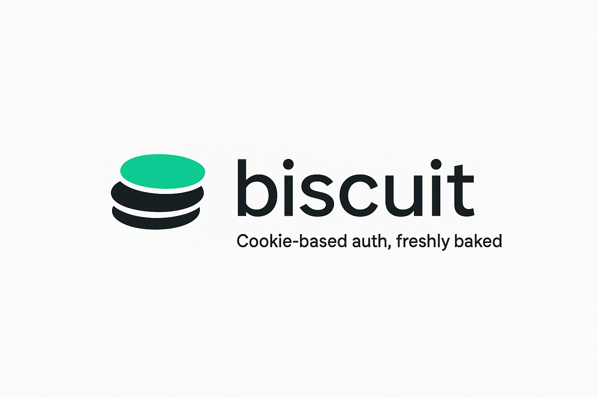

<div align="center">
  
  
  <h3>Lightweight Nuxt module for Laravel Sanctum cookie authentication</h3>
  
  <p>
    <a href="https://nuxt.com">
      
    </a>
    <a href="https://www.npmjs.com/package/nuxt-biscuit">
      
    </a>
    <a href="https://www.npmjs.com/package/nuxt-biscuit">
      
    </a>
    <a href="https://github.com/ludoguenet/nuxt-biscuit/blob/main/LICENSE">
      
    </a>
    <a href="https://github.com/ludoguenet/nuxt-biscuit">
      
    </a>
  </p>
</div>

---

Lightweight Nuxt module for Nuxt 3/4 that wires a Nuxt frontend to a Laravel Sanctum backend using first-party cookie authentication. Nuxt Biscuit ships a preconfigured composable, route middleware, and runtime plugin so you can log users in, out, and guard pages with only a few lines of code.

## ✨ Features

- ✅ Fetches and caches the authenticated user automatically on app mount
- 🍪 Handles Sanctum CSRF cookie flow (including decoding `XSRF-TOKEN`)
- 🔐 Provides `auth` and `guest` route middleware for protected/guest pages
- ⚙️ Exposes a fully typed `useBiscuit` composable with `login`, `logout`, `fetchUser`, and `onUserChange`
- 🔁 Emits client-side hooks whenever the user session changes

## 📋 Requirements

- Nuxt `^3.0.0 || ^4.0.0`
- Laravel backend configured with Sanctum and cookie-based authentication

## 🚀 Installation

Add the dependency to your project:

```bash
npm install nuxt-biscuit
```

Register the module inside your `nuxt.config`:

```ts
export default defineNuxtConfig({
  modules: ['nuxt-biscuit'],
  biscuit: {
    baseUrl: process.env.API_BASE_URL ?? 'http://localhost:8000',
    endpoints: {
      csrf: '/sanctum/csrf-cookie',
      login: '/login',
      logout: '/logout',
      user: '/api/user'
    },
    redirect: {
      onLogin: '/',
      onLogout: '/login',
      onAuthOnly: '/login',
      onGuestOnly: '/'
    }
  }
})
```

All options are optional. Values you omit fall back to the defaults shown above.

## 📖 Usage

### Composable

Call `useBiscuit()` inside your components or pages to access the current user and helpers:

```ts
const { user, isGuest, isChecked, login, logout, fetchUser, onUserChange } = useBiscuit()
```

- `login(credentials)` automatically fetches the Sanctum CSRF cookie, posts credentials, updates user state, and redirects to `redirect.onLogin`. The credentials object should contain `email`, `password`, and optionally `remember` (boolean).

Example usage:

```ts
const { login } = useBiscuit()

await login({
  email: 'user@example.com',
  password: 'password',
  remember: true // optional: remember the user's session
})
```
- `logout()` posts to the logout endpoint, clears user state, fires change hooks, and redirects to `redirect.onLogout`.
- `fetchUser()` fetches the authenticated user and populates shared state; it safely handles guest responses.
- `onUserChange(callback)` runs on the client whenever the session transitions between guest and authenticated.

### Middleware

Register the bundled route middleware in your pages:

```ts
definePageMeta({
  middleware: ['auth'] // blocks guests, redirects to `redirect.onAuthOnly`
})

definePageMeta({
  middleware: ['guest'] // blocks authenticated users, redirects to `redirect.onGuestOnly`
})
```

Both middleware calls ensure the user is fetched exactly once per client session before performing redirects.

### Programmatic Navigation Hooks

The plugin keeps `user`, `isChecked`, and `hooks` in a Nuxt state namespace. If you need to react to login/logout globally (e.g. to fetch extra data), use the composable hook:

```ts
const { onUserChange } = useBiscuit()

onUserChange((newUser) => {
  if (newUser) {
    // user just logged in
  } else {
    // user just logged out
  }
})
```

---

## 🔐 Understanding Laravel Sanctum Cookie Authentication

This section explains how Laravel Sanctum's cookie-based authentication works under the hood, helping you understand what Nuxt Biscuit handles for you.

### Overview

Laravel Sanctum provides **cookie-based authentication** for same-domain SPAs (Single Page Applications). Unlike token-based auth, it uses HTTP-only session cookies stored server-side, making it more secure and easier to manage.

### Backend Setup (Laravel)

#### 1. Configuration

```php
// config/sanctum.php
'stateful' => explode(',', env('SANCTUM_STATEFUL_DOMAINS', 'localhost,127.0.0.1')),

// .env
SANCTUM_STATEFUL_DOMAINS=localhost:3000,127.0.0.1:3000
```

This tells Sanctum which domains are allowed to use cookie-based authentication.

#### 2. Required Endpoints

**CSRF Cookie Endpoint** (`/sanctum/csrf-cookie`):
- Built into Sanctum (no custom route needed)
- Sets `XSRF-TOKEN` cookie (URL-encoded CSRF token)
- Returns `204 No Content`
- Cookie attributes: `HttpOnly=false`, `SameSite=Lax`, `Secure` (in production)

**Login Endpoint** (`/login`):
```php
Route::post('/login', function (Request $request) {
    $credentials = $request->validate([
        'email' => 'required|email',
        'password' => 'required',
    ]);

    if (Auth::attempt($credentials, $request->boolean('remember'))) {
        $request->session()->regenerate(); // Prevents session fixation
        return response()->json(['message' => 'Logged in']);
    }

    return response()->json(['message' => 'Invalid credentials'], 422);
});
```

**User Endpoint** (`/api/user`):
```php
Route::middleware(['web', 'auth:sanctum'])->get('/api/user', function (Request $request) {
    return $request->user();
});
```

**Logout Endpoint** (`/logout`):
```php
Route::post('/logout', function (Request $request) {
    Auth::logout();
    $request->session()->invalidate();
    $request->session()->regenerateToken();
    return response()->json(['message' => 'Logged out']);
});
```

#### 3. CORS Configuration

```php
// config/cors.php
'paths' => ['api/*', 'sanctum/csrf-cookie'],
'allowed_origins' => ['http://localhost:3000'],
'supports_credentials' => true, // Required for cookies!
```

### Frontend Flow (What Nuxt Biscuit Handles)

#### 1. Initial Load / App Bootstrap

On app mount, the module automatically:
- Checks if a session cookie exists
- Calls `/api/user` to fetch the current user
- Populates user state if authenticated

#### 2. Login Flow

```ts
// Step 1: Get CSRF cookie
GET /sanctum/csrf-cookie
→ Backend sets XSRF-TOKEN cookie

// Step 2: Read XSRF-TOKEN from cookie (URL-decoded)
const xsrfToken = decodeURIComponent(cookieValue)

// Step 3: Login with CSRF token in header
POST /login
Headers: {
  'X-XSRF-TOKEN': xsrfToken,
  'X-Requested-With': 'XMLHttpRequest',
  'Accept': 'application/json'
}
Body: { email, password, remember? }
→ Backend creates session, sets session cookie

// Step 4: Fetch user to confirm login
GET /api/user
→ Returns authenticated user data
```

#### 3. Authenticated Requests

After login, every request automatically includes:
- **Session cookie** (sent automatically by browser via `credentials: 'include'`)
- **X-XSRF-TOKEN header** (read from `XSRF-TOKEN` cookie and decoded)

Nuxt Biscuit handles this automatically via `withRequestHeaders()`.

#### 4. Logout Flow

```ts
POST /logout
Headers: { 'X-XSRF-TOKEN': xsrfToken }
→ Backend invalidates session
→ Frontend clears user state
```

### Security Mechanisms

#### 1. CSRF Protection

How it works:
1. Backend sets `XSRF-TOKEN` cookie (not HttpOnly, so JavaScript can read it)
2. Frontend reads cookie and sends as `X-XSRF-TOKEN` header
3. Laravel compares cookie value with header value
4. If they match → request is legitimate (same origin)

**Why this works:**
- Attackers can't read cookies from other domains (Same-Origin Policy)
- They can't set custom headers in cross-origin requests
- Only your frontend can read the cookie and send it back

#### 2. Session Management

- Session stored **server-side** (in database/cache/file)
- Session ID sent as cookie (`HttpOnly`, `Secure`, `SameSite`)
- Session regeneration on login prevents session fixation attacks

#### 3. Cookie Attributes

Laravel sets these automatically:
- `HttpOnly: true` - JavaScript can't access (security)
- `Secure: true` - HTTPS only (production)
- `SameSite: Lax` - CSRF protection
- `Path: /` - Available site-wide

### Complete Authentication Flow

```
Frontend (Nuxt)          Backend (Laravel)
     │                          │
     │ 1. GET /sanctum/csrf-cookie
     │─────────────────────────>│
     │                          │ Sets XSRF-TOKEN cookie
     │<─────────────────────────│ (204 No Content)
     │                          │
     │ 2. Read XSRF-TOKEN cookie│
     │    (decodeURIComponent)  │
     │                          │
     │ 3. POST /login            │
     │    X-XSRF-TOKEN header    │
     │─────────────────────────>│
     │                          │ Validates credentials
     │                          │ Creates session
     │                          │ Sets session cookie
     │<─────────────────────────│ (200 OK)
     │                          │
     │ 4. GET /api/user          │
     │    (with session cookie)  │
     │─────────────────────────>│
     │                          │ Checks session
     │                          │ Returns user data
     │<─────────────────────────│ (200 OK + user JSON)
     │                          │
     │ 5. Subsequent requests   │
     │    (session cookie +     │
     │     X-XSRF-TOKEN header) │
     │─────────────────────────>│
     │                          │ Validates session
     │                          │ Returns data
     │<─────────────────────────│
```

### Cookie-Based vs Token-Based Auth

| Cookie-Based (Sanctum) | Token-Based (Sanctum/Passport) |
|------------------------|--------------------------------|
| Session stored server-side | Token stored client-side |
| Automatic cookie sending | Manual header injection |
| CSRF protection needed | No CSRF (stateless) |
| Same-domain only | Cross-domain possible |
| More secure (HttpOnly cookies) | Less secure (stored in localStorage) |
| Session invalidation easy | Token revocation harder |

### Common Gotchas & Tips

1. **`credentials: 'include'`** - Must be set on all fetch requests to send/receive cookies
2. **CORS `supports_credentials: true`** - Required on backend CORS configuration
3. **SameSite cookies** - Must match domain configuration in `SANCTUM_STATEFUL_DOMAINS`
4. **XSRF token decoding** - Cookie is URL-encoded, must decode with `decodeURIComponent()`
5. **Session regeneration** - Backend should regenerate session ID on login (prevents fixation)
6. **Domain matching** - Frontend and backend must share the same top-level domain (or be on the same domain)
7. **HTTPS in production** - `Secure` cookie flag requires HTTPS

### What Nuxt Biscuit Handles For You

- ✅ Automatically fetches CSRF cookie before login
- ✅ Reads and decodes XSRF token from cookies
- ✅ Adds CSRF token to all authenticated requests
- ✅ Manages session state across SSR and client
- ✅ Handles cookie forwarding in SSR context
- ✅ Provides type-safe composables and middleware
- ✅ Auto-fetches user on app mount
- ✅ Emits hooks for session changes

---

## 📄 License

Licensed under the [MIT license](LICENSE).
